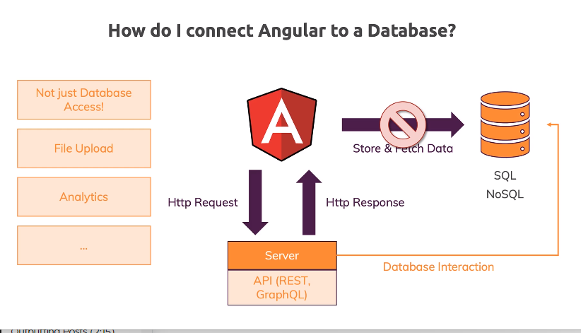
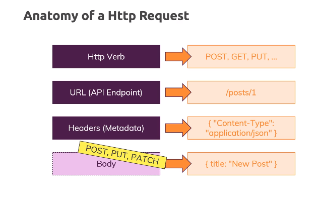
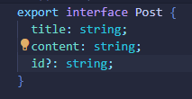
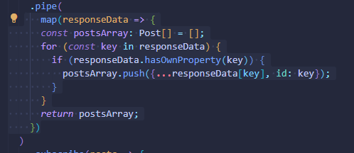

## Http & Backend Interaction

We will learn how Angular works with data on the backend, how http requests work, and how to transform data if we need to (observables section).

## How Does Angular Interact With Backends?

More on Securing JavaScript in the Browser: https://academind.com/learn/javascript/hide-javascript-code/

Learn how to build a REST API: https://academind.com/learn/node-js/building-a-restful-api-with/ 

## The Anatomy of a Http Request

## Backend (Firebase) Setup

We're going to use Firebase, which will give us an entire backend to work with!

## Sending a POST Request

NEVER communicate directly with a database in your Angular app. That way it protects the information being logged, and not just anyone can view this information online.

Need to change link for the Firebase one like this:

https://ng-complete-guide-b53d6-default-rtdb.firebaseio.com/posts.json

## GETting Data

## Using Rx JS Operators to Transform Response Data

## Using Types with the HttpClient

So turns out the question mark next to the id for the string means that the string is OPTIONAL

## Outputting Posts

## Showing a Loading Indicator

We can show a loading indicator while we're fetching posts. We also added a loading screen!

## Using a Service for Http Requests

See the highlighted part? We want to eventually replace that with a *service*.

## Services & Components Working Together

(stopped here)