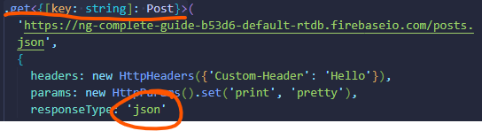

1) What is an API?

APIs are mechanisms that enable two software components to communicate with each other using a set of definitions and protocols. For example, the weather bureau's software system contains daily weather data. The weather app on your phone “talks” to this system via APIs and shows you daily weather updates on your phone.

2) What are HTTP requests? What is the purpose of requests?

An HTTP request is made by a client, to a named host, which is located on a server. The aim of the request is to access a resource on the server. To make the request, the client uses components of a URL (Uniform Resource Locator), which includes the information needed to access the resource.

3) What are the main HTTP verbs?

Get, Post, Delete, and Put

4) How does Angular make HTTP requests?

HTTP: Request data from a serverlink. Use the HttpClient.get() method to fetch data from a server. The asynchronous method sends an HTTP request, and returns an Observable that emits the requested data when the response is received.

----------------

## Http & Backend Interaction

We will learn how Angular works with data on the backend, how http requests work, and how to transform data if we need to (observables section).

## How Does Angular Interact With Backends?

More on Securing JavaScript in the Browser: https://academind.com/learn/javascript/hide-javascript-code/

Learn how to build a REST API: https://academind.com/learn/node-js/building-a-restful-api-with/ 

## The Anatomy of a Http Request

## Backend (Firebase) Setup

We're going to use Firebase, which will give us an entire backend to work with!

## Sending a POST Request

NEVER communicate directly with a database in your Angular app. That way it protects the information being logged, and not just anyone can view this information online.

Need to change link for the Firebase one like this:

https://ng-complete-guide-b53d6-default-rtdb.firebaseio.com/posts.json

## GETting Data

## Using Rx JS Operators to Transform Response Data

## Using Types with the HttpClient

So turns out the question mark next to the id for the string means that the string is OPTIONAL

## Outputting Posts

## Showing a Loading Indicator

We can show a loading indicator while we're fetching posts. We also added a loading screen!

## Using a Service for Http Requests

See the highlighted part? We want to eventually replace that with a *service*.

## Services & Components Working Together

## Sending a DELETE Request

*THIS will come in handy with the recipe app*

## Handling Errors

Service offline? Or other stuff?

*Take a look at Firebase's Rules under Database*

## Using Subjects for Error Handling

## Using the catchError Operator

## Setting Headers

## Adding Query Params

##  Observing Different Types of Responses 

## Changing the Response Body Type

Says right here, because it's getting the JS, it needs to be json, not text. Needs to be treated as a JS object!

## Introducing Interceptors

## Manipulating Request Objects

We get more stuff logged into the console. Yippee

## Response Interceptors

## Wrap Up

- angular http client
- most common send request by get on, request body and perhaps some headers... practice these most!
- methods get and post return obsv you need to subscribe to request and send
- operators to log data and catch errors, but in a service/component you need to subscribe. Then pass a function to get data back and handle error handlers...
- advanced settings the power to view what you want to observe

## Useful Resources and Links

Official Docs: https://angular.io/guide/http
